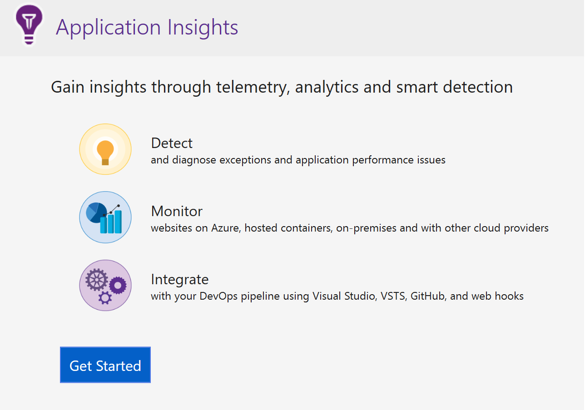

# Configuring Application Insights for your App

To configure Application Insights in Visual Studio 

When you create a new solution in Visual Studio, you can connect your app to Application Insights.
- Right click the project and go to Add >>
Connected Services.

The 'Monitoring with Application Insights is not' enabled.

Click on the link and when on the getting started page, click 'Get Started'

Select the Application Insights instance in the drop down list (Existing Resource) or the default value to create a new one (New resource)

The Getting Started adds the Application Insights SDK to your application.

Once configured Application Insights SDK has been added to the app and the app has been registered to the instance...

... and checked in the Connected Services page. This page allows you to come back to the Resource Settings for Application Insights UI later if you need to.

A number of files are modified in your app including the appsettings.json file which now has the instrumentation key of Application Insights.

As soon as you have registered your application to Application Insights you can start running the App on your local dev machine (e.g. in IISExpress with VS), the data will start feeding to Application Insights. In the Requests and pageViews table for instance. You can use the Azure portal to visualise the metrics of your app. (how much server metrics are collected since it is running on local vm?)

The next step is to deploy your app to the cloud compute. In this case Azure WebApp. Through the deploy via Visual Studio, since Application Insights has been configured on the app, it will automatically enable AppInsights for the App Service. 

This is now a configuration where Application Insights continues to be tracking application telemetry but now also the App Service starts reporting on the compute side values such as CPU i.e. the Azure resource hosting the site.

So:
- You don't need to deploy your app to Azure to use Application Insights. Whereever you app is running, as long as it has the instrumention key to connect to the instance.
- When you deploy to Application Insights, make sure that the instance for the App Service is the same that the one deployed in your app.